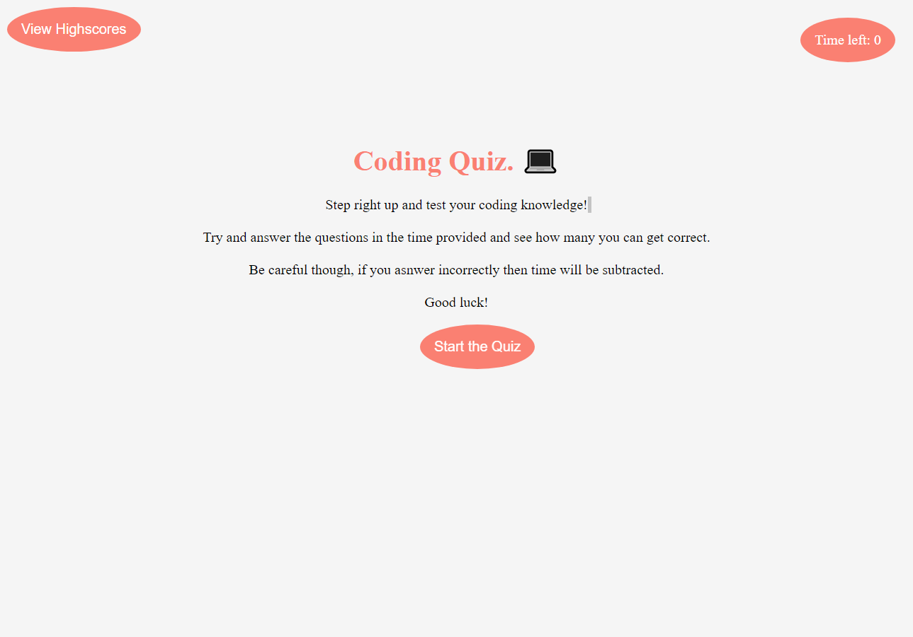

# Code Quiz

# Project Title

Web APIs Challenge: Code Quiz
 
## Description

The goal of this weeks challenge is to design a functioning quiz using javascript and web APIs. To accomplish this task we are builnding this from scratch, so we are resposible for making the file structure and the design of the page.   

## Links 

Link to live url: https://samualjensen.github.io/Js-Code-Quiz/

Link to repository: https://github.com/Samualjensen/Js-Code-Quiz

## Usage

When the webpage is deployed it can be viewed normally on a standard desktop browser. It has not yet been modified to fit a smaller screen yet.

## License

